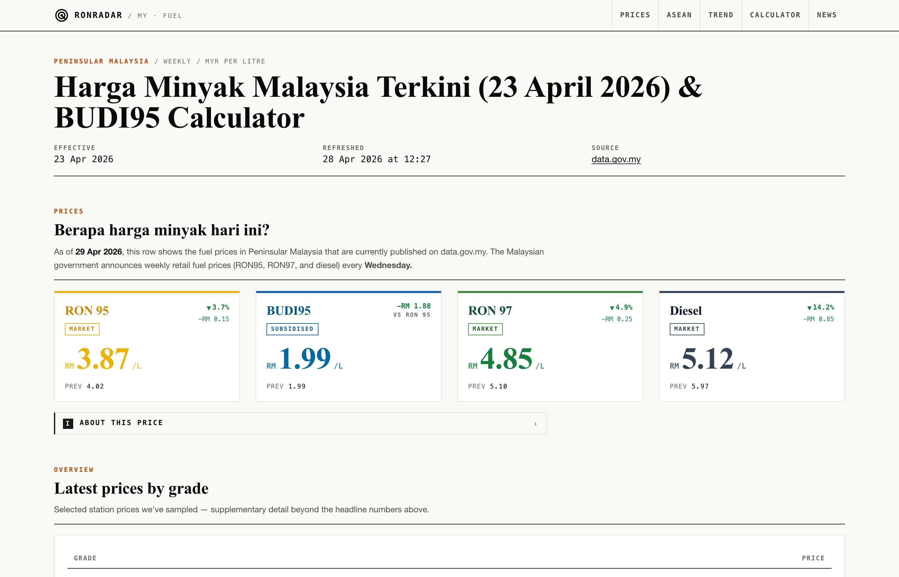
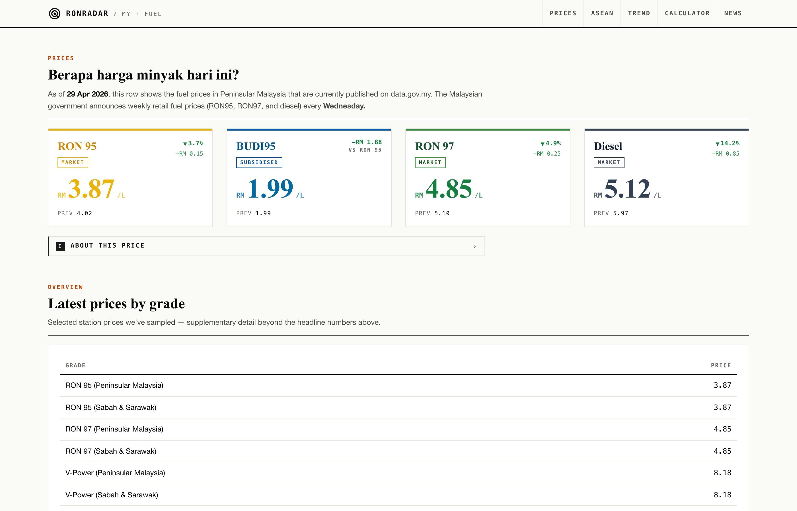
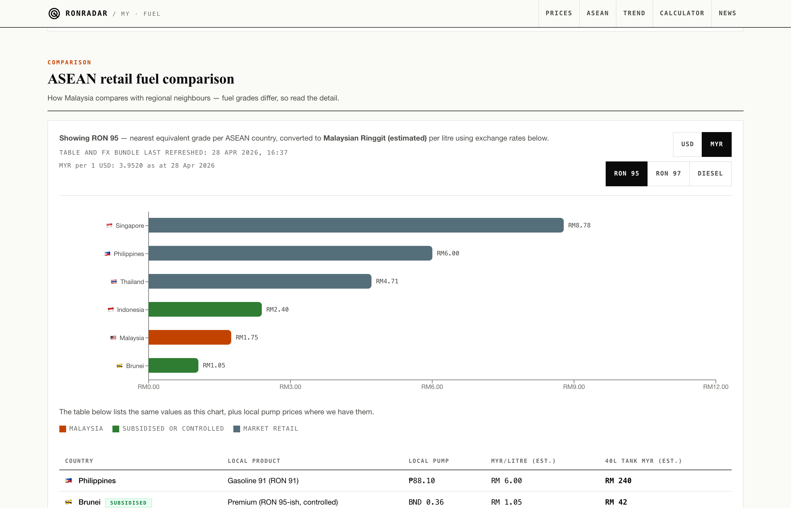
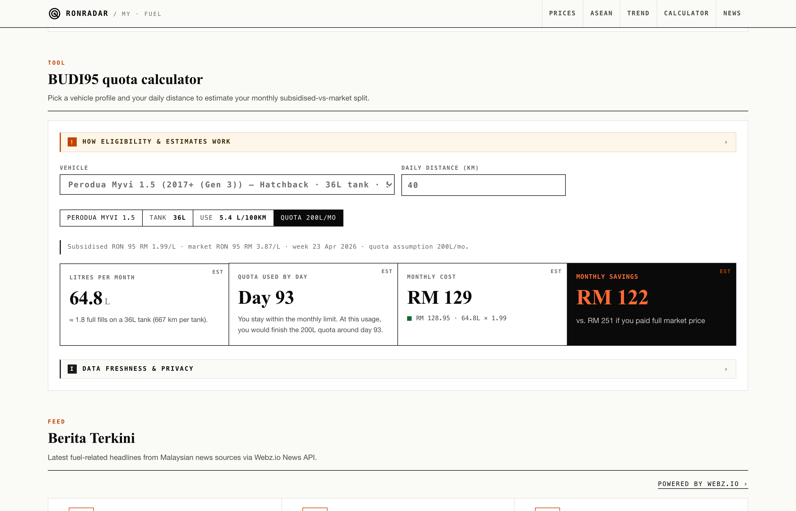
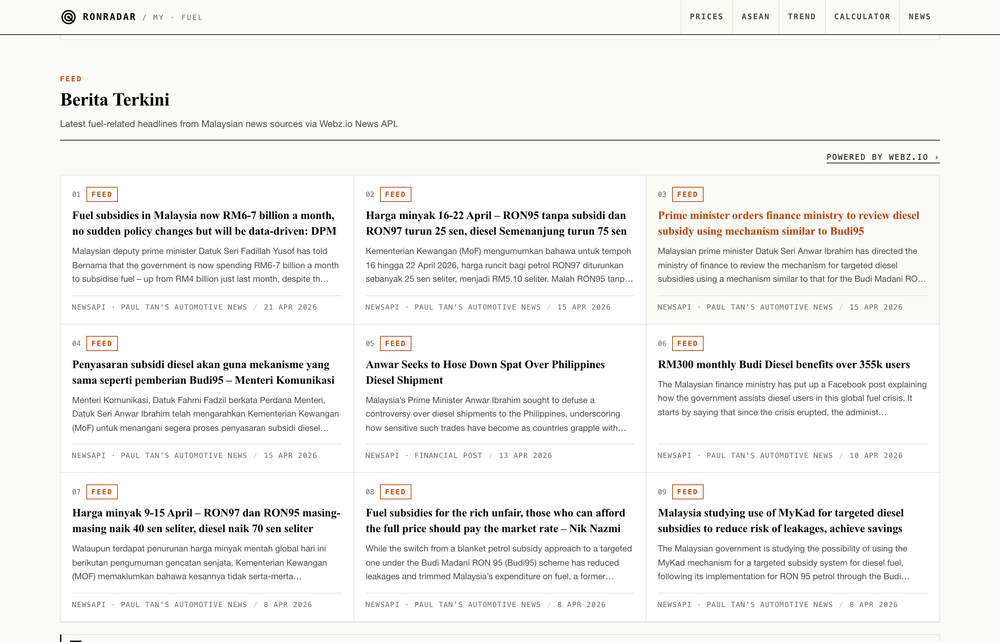
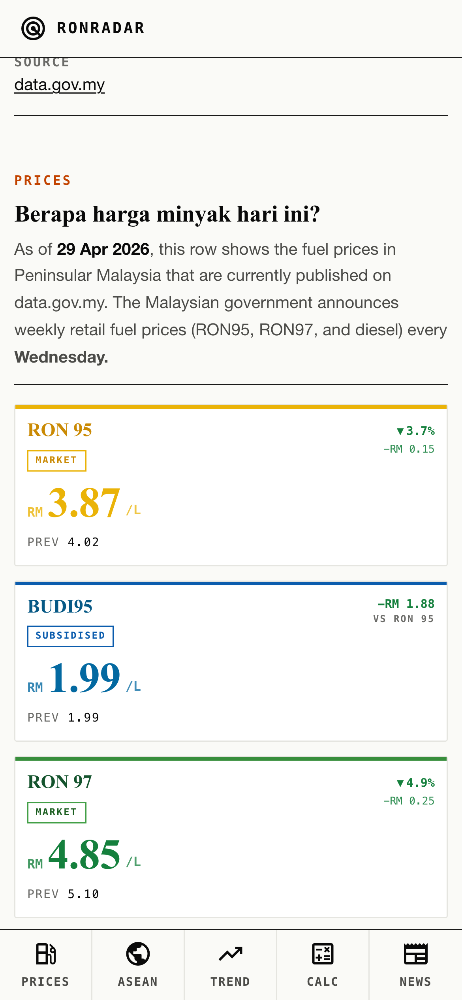

# ⛽ RONradar — Malaysia Fuel Price Dashboard

> Track Malaysia's weekly government fuel price announcements, compare prices across ASEAN, and calculate your monthly BUDI95 subsidy spend.



🔗 **[Live → malaysia-fuel-dashboard.onrender.com](https://malaysia-fuel-dashboard.onrender.com)**

<p align="center">
  
  
  
  
  
</p>

---

## What Is This?

RONradar pulls official fuel prices from [data.gov.my](https://data.gov.my/) every Thursday and presents them in a clean dashboard — price cards, 12-week trend chart, ASEAN regional comparison, and the latest subsidy news from Malaysian publishers.

The BUDI95 calculator lets Malaysians estimate their monthly fuel spend based on their car and daily commute, and see exactly how much the government subsidy saves them each month.

---

## Screenshots

| Fuel prices | ASEAN comparison |
|---|---|
|  |  |

| BUDI95 calculator | Berita Terkini |
|---|---|
|  |  |

<p align="center">
  
  <br/>
  <em>Mobile (iPhone)</em>
</p>

---

## Features

- 📊 **Weekly price cards** — RON 95 (BUDI95 subsidised + market ceiling), RON 97, Diesel from the official MOF announcement
- ⛽ **Pump prices** — Shell Malaysia live grades (Peninsular + Sabah & Sarawak), scraped weekly
- 🌏 **ASEAN comparison** — bar chart + table comparing MY · SG · TH · ID · BN · PH, converted to MYR via live FX rates
- 📈 **12-week trend chart** — rolling price history
- 🧮 **BUDI95 calculator** — pick your car model, enter daily distance, see estimated monthly spend and subsidy savings
- 📰 **Berita Terkini** — latest Malaysia fuel & subsidy headlines via NewsAPI.org

---

## Tech Stack

| Layer | Tech |
|---|---|
| Frontend | Next.js 14 (static export) · TypeScript · Tailwind CSS · Recharts |
| Backend | FastAPI · SQLAlchemy · Gunicorn + Uvicorn |
| Database | PostgreSQL |
| Hosting | [Render](https://render.com) — Static Site + Web Service + Managed DB |
| News | [NewsAPI.org](https://newsapi.org) · Bing News RSS (fallback) |
| FX rates | [Fixer.io](https://fixer.io) (daily disk cache) |
| Monitoring | [Sentry](https://sentry.io) |

---

## Project Layout

```
.
├── backend/
│   ├── app/
│   │   ├── api/               # Routers: prices, news, trends, admin, auth
│   │   ├── main.py            # FastAPI entry, CORS, security headers
│   │   ├── data_fetcher.py    # data.gov.my weekly sync
│   │   ├── asean_scraper.py   # ASEAN prices + FX conversion
│   │   └── newsapi_fetcher.py # NewsAPI.org integration
│   └── tests/                 # 21 pytest tests
└── frontend/
    └── src/
        ├── pages/index.tsx    # Dashboard
        ├── components/        # FuelCard, AseanComparison, TrendChart, BudiCalculator, NewsGrid
        └── lib/               # Types, formatters, constants, localStorage cache
```

---

## License

MIT — see [LICENSE](LICENSE).
