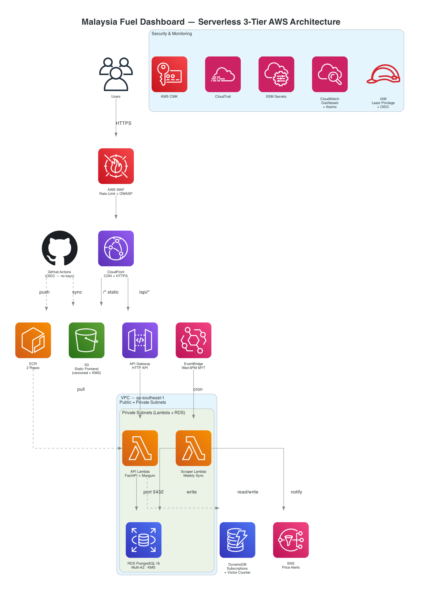

# Malaysia Fuel Price Dashboard

A serverless full-stack app that tracks Malaysia’s weekly fuel prices from [data.gov.my](https://data.gov.my/) and displays them in a dashboard. Deployed on **AWS** with **Terraform** and **GitHub Actions** (OIDC — no static AWS keys in CI).



## Stack

- **Frontend:** Next.js (static export), Tailwind, Recharts → **S3** + **CloudFront**
- **Backend:** FastAPI + Mangum → **Lambda** (container from **ECR**) behind **API Gateway HTTP**
- **Data:** **RDS PostgreSQL** (private subnet), **DynamoDB** for subscriptions, **SNS** for alerts
- **Jobs:** **EventBridge** cron → scraper Lambda
- **IaC:** Terraform (`infra/`) · **CI/CD:** `.github/workflows/deploy.yml`

Interactive API docs: `/docs` when the backend is running locally or via CloudFront `/api/*`.

**Berita Terkini** pulls live RSS headlines (fuel / subsidy related), stores them in Postgres/SQLite, and links out to sources. Tune feeds with env var `NEWS_RSS_URLS` (see [docs/ARCHITECTURE.md](docs/ARCHITECTURE.md)).

## Quick start (local)

```bash
git clone https://github.com/zuftt/malaysia-fuel-dashboard.git
cd malaysia-fuel-dashboard

# Backend — http://localhost:8000/docs
cd backend && pip install -r requirements.txt && uvicorn app.main:app --reload --port 8000

# Frontend — http://localhost:3000 (new terminal)
cd frontend && npm install && echo 'NEXT_PUBLIC_API_URL=http://localhost:8000' > .env.local && npm run dev
```

## Deploy (AWS)

See **[DEPLOYMENT.md](DEPLOYMENT.md)** — `terraform apply` in `infra/`, then Docker Buildx push to ECR and sync the static site to S3, or rely on GitHub Actions after setting repository secrets (`AWS_ROLE_ARN`, `S3_BUCKET`, `CLOUDFRONT_DISTRIBUTION_ID`).

More detail: [infra/README.md](infra/README.md). Architecture notes: [docs/ARCHITECTURE.md](docs/ARCHITECTURE.md).

## Testing (local)

```bash
# Backend — needs network on first run (sync from data.gov.my)
cd backend && pip install -r requirements.txt -r requirements-dev.txt && pytest -q

# Frontend
cd frontend && npm ci && npm run lint && NEXT_PUBLIC_API_URL="" npm run build

# Terraform (from infra/)
terraform init -backend=false && terraform validate && terraform fmt -check -recursive
```

Docker builds (`Dockerfile`, `Dockerfile.scraper`) require a running Docker daemon — same commands as [DEPLOYMENT.md](DEPLOYMENT.md).

## Project layout

```
.
├── backend/app/       # FastAPI, Mangum handler, scraper Lambda
├── frontend/          # Next.js
├── infra/             # Terraform
├── docs/              # Architecture doc
└── .github/workflows/ # Deploy on push to main
```

## License

MIT — see [LICENSE](LICENSE).
