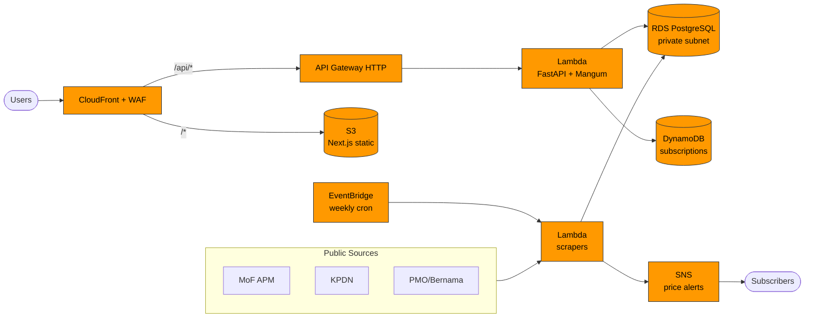

<div align="center">

# Malaysia Fuel & Policy Intelligence Dashboard

**A real-time, single-pane-of-glass for tracking fuel prices, government policy, and subsidy intelligence across Malaysia.**

[](https://nextjs.org/)
[](https://fastapi.tiangolo.com/)
[](https://aws.amazon.com/)
[](https://www.terraform.io/)
[](LICENSE)

[Features](#features) · [Architecture](#architecture) · [Quick Start](#quick-start) · [Deployment](#deployment) · [API](#api) · [Contributing](#contributing)

</div>

---

## Overview

Fuel pricing in Malaysia is shaped by weekly APM announcements, KPDN bulletins, PMO policy releases, and global benchmarks like MOPS Singapore. This project unifies all of those signals into one dashboard so analysts, journalists, and citizens can track what's happening — and *why* — in real time.

The whole stack runs **serverless on AWS** for ~$17/month, deployed via Terraform and GitHub Actions.

## Features

- **Real-time fuel prices** — RON95, RON97, Diesel, with weekly APM tracking
- **Global benchmark comparison** — Local prices vs MOPS Singapore
- **Policy intelligence** — Aggregated MoF, KPDN, PMO, and Bernama feeds
- **Smart alerts** — Subscribe to price-change and legislative-update notifications via SNS
- **Tag-based filtering** — `#BUDI95`, `#Rationalization`, `#FuelFloating`
- **Admin panel** — Manual validation and overrides for scraped data
- **Production-grade security** — WAF, KMS encryption, private RDS, CloudTrail audit

## Architecture




**Tech stack**

| Layer | Technology |
|---|---|
| Frontend | Next.js 14 (static export), TailwindCSS, Recharts |
| Backend | FastAPI, SQLAlchemy, Pydantic, Mangum (Lambda adapter) |
| Database | PostgreSQL on RDS · DynamoDB (subscriptions) |
| Compute | AWS Lambda (containerized via ECR) |
| Edge | CloudFront + AWS WAF |
| Scheduling | EventBridge (weekly Wed 6PM MYT) |
| Notifications | SNS |
| IaC | Terraform |
| CI/CD | GitHub Actions |
| Observability | CloudWatch Dashboards + CloudTrail |

## Quick Start

**Prerequisites:** Python 3.11+, Node.js 18+, Docker (optional), Terraform 1.6+ (for deploy).

```bash
# Clone
git clone https://github.com/<you>/malaysia-fuel-dashboard.git
cd malaysia-fuel-dashboard

# Backend
cd backend
pip install -r requirements.txt
uvicorn app.main:app --reload
# → http://localhost:8000/docs

# Frontend (new terminal)
cd frontend
npm install
npm run dev
# → http://localhost:3000
```

### Run with Docker

```bash
docker build -t fuel-api -f Dockerfile .
docker run -p 8000:8000 fuel-api
```

## Deployment

The entire AWS stack is managed by Terraform under [infra/](infra/).

```bash
cd infra
cp terraform.tfvars.example terraform.tfvars   # set region, db password, domain
terraform init
terraform plan
terraform apply
```

CI/CD is wired up via [.github/workflows/deploy.yml](.github/workflows/deploy.yml):

1. On push to `main`, GitHub Actions builds the Lambda container image
2. Pushes to ECR
3. Updates Lambda functions
4. Builds Next.js and syncs to S3 + CloudFront invalidation

See [DEPLOYMENT.md](DEPLOYMENT.md) and [infra/README.md](infra/README.md) for the full walkthrough, IAM bootstrap, and cost breakdown (~$17/mo).

## Testing

```bash
# Backend
cd backend && pytest

# Frontend
cd frontend && npm run build && npm run lint

# Infra
cd infra && terraform fmt -check -recursive && terraform validate
```

## API

Interactive OpenAPI docs at `/docs` once the backend is running.

| Endpoint | Description |
|---|---|
| `GET /api/prices/latest` | Latest fuel prices for all grades |
| `GET /api/prices/history?grade=ron95&days=90` | Historical price series |
| `GET /api/news?tag=BUDI95` | Filtered policy & news feed |
| `GET /api/trends/benchmark` | Local vs MOPS Singapore comparison |
| `POST /api/alerts/subscribe` | Subscribe to price/policy alerts |
| `GET /health` | Liveness probe |

Full spec: [docs/API_SPEC.md](docs/API_SPEC.md).

## Project Structure

```
.
├── backend/              # FastAPI app + Lambda handlers
│   └── app/
│       ├── api/          # Route modules (prices, news, trends, auth, admin)
│       ├── lambdas/      # Scraper Lambda entrypoint
│       ├── main.py       # FastAPI + Mangum
│       ├── models.py     # SQLAlchemy models
│       └── data_fetcher.py
├── frontend/             # Next.js 14 (static export)
│   └── src/pages/
├── infra/                # Terraform — VPC, RDS, Lambda, CloudFront, WAF, etc.
├── docs/                 # Architecture, schema, API spec
├── Dockerfile            # API Lambda container
├── Dockerfile.scraper    # Scraper Lambda container
└── .github/workflows/    # CI/CD
```

## Contributing

Issues and PRs welcome. Please run the test commands above before submitting.

## License

MIT — see [LICENSE](LICENSE).

---

<div align="center">

Built for Malaysia's fuel intelligence community.

</div>
