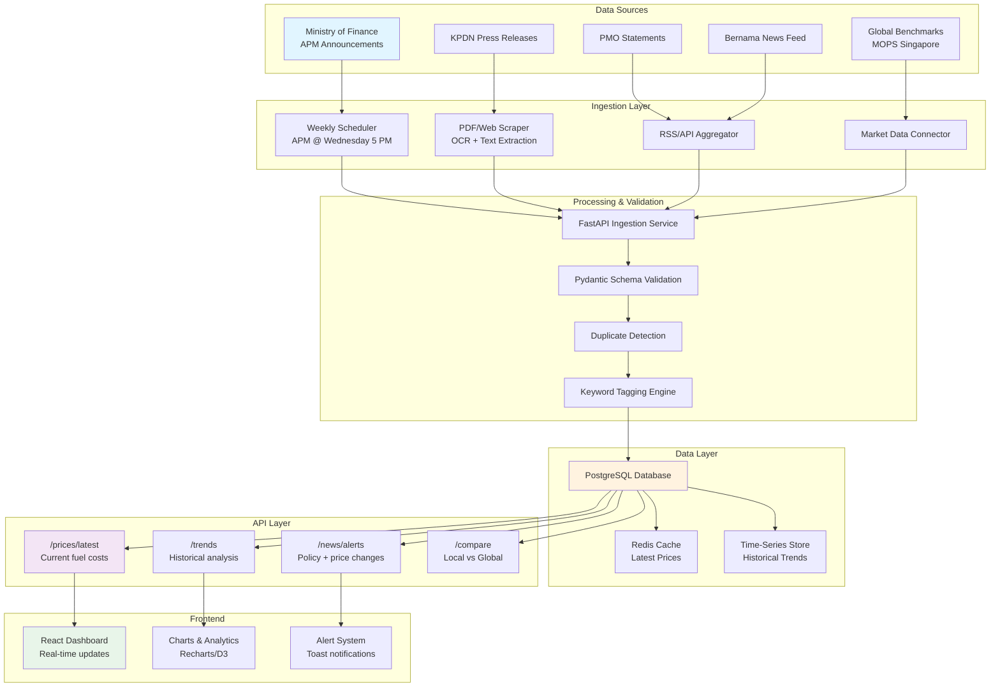

# System Architecture

## High-Level Data Flow (Mermaid)

## Component Breakdown

### 1. Data Ingestion (Weekly Schedule)
- **Trigger:** Every Wednesday at 5:00 PM (Malaysia Standard Time)
- **Sources:**
  - MOF APM Bulletin (PDF + HTML)
  - KPDN Official Price List
  - PMO Press Release Feed
  - Bernama RSS (filtered: fuel-related)
- **Strategy:**
  - **PDF/HTML:** BeautifulSoup4 + PyPDF2 for text extraction, regex for price parsing
  - **RSS:** feedparser library with caching
  - **OCR Fallback:** Tesseract for image-based PDFs

### 2. Validation & Enrichment
- **Pydantic Models:** Strict schema validation (date, price format, decimal precision)
- **Duplicate Detection:** Hash-based deduplication (source + date + price)
- **Keyword Tagging:** Regex + NLP for tags (#BUDI95, #FuelFloating, #Rationalization)
- **Alert Generation:** Compare against last known price, flag significant changes (>5%)

### 3. Database Design
- **Fuel Prices Table:** Track RON95/RON97/Diesel across Peninsular & East Malaysia
- **News/Announcements:** Timestamp, source, content, extracted price deltas, policy keywords
- **Historical Snapshots:** Time-series data for trend analysis
- **Alert Rules:** Trigger thresholds for email/SMS notifications

### 4. API Endpoints
- **GET /prices/latest** → Current fuel prices + timestamp
- **GET /prices/history?days=30** → Historical data for charting
- **GET /news/alerts** → Recent price changes + policy updates
- **GET /news/search?tag=BUDI95** → Filter by keywords
- **GET /trends/vs-global** → Malaysia vs MOPS Singapore comparison
- **POST /admin/validate** → Manual data correction endpoint (auth required)

### 5. Frontend Real-Time Updates
- **WebSocket Connection:** Push price updates to connected clients
- **Chart Updates:** Recharts with real-time data binding
- **Toast Alerts:** Trigger notifications on significant price changes
- **Filter Sidebar:** Tag-based filtering (#BUDI95, #Rationalization, etc.)

---

## Deployment Strategy

**Development:**
- FastAPI on localhost:8000
- React dev server on localhost:3000
- SQLite for testing (or PostgreSQL locally)

**Production:**
- FastAPI: Docker container (Gunicorn + Uvicorn)
- React: Static build deployed to Vercel/Netlify
- PostgreSQL: Managed service (AWS RDS or similar)
- Celery + Redis: For background scraping tasks
- GitHub Actions: CI/CD pipeline for testing + deployment

---

## Security Considerations

- API authentication: JWT tokens for admin endpoints
- Rate limiting: Prevent scraper abuse
- HTTPS only: All external API calls
- Data validation: Pydantic strict mode on all inputs
- CORS: Whitelist frontend domain
- Secrets management: Environment variables for credentials

---

## Performance Metrics

- **Ingestion Latency:** < 5 minutes from MOF announcement to dashboard
- **API Response Time:** < 500ms for /prices/latest
- **Chart Rendering:** < 2s for 90-day historical view
- **Uptime SLA:** 99.5% (resilience to source outages)

---

## Future Enhancements

1. **Machine Learning:** Predictive models for price changes based on global oil trends
2. **SMS/Email Alerts:** Notifications for significant price changes
3. **Comparative Analysis:** Fuel subsidies vs regional neighbors (Singapore, Thailand)
4. **Mobile App:** React Native version for on-the-go alerts
5. **Integration:** Telegram bot for instant price alerts
6. **Analytics:** Dashboard usage analytics + user heatmaps

